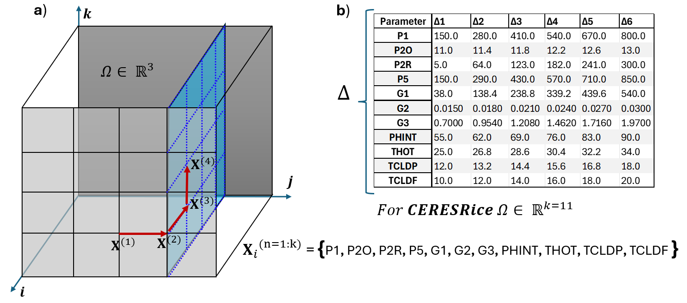

# **Sensitivity analysis for CERES-Rice crop growth model**

The Morris method is a global sensitivity analysis technique that is used to identify influential parameters in complex mathematical models. 
The method proposes a sampling strategy based on random selection of one factor per time to assess parameter sensitivity while ensuring computational efficiency [1,2].

  

Figure No.1: Morris method for global sensitivity analysis in crop growth model CERES-Rice. a) Sampling strategy based on random selection of one factor per time for Rk=3. b) Step size (∆) per crop parameter in Rk=11
     

  

Figure No.2: Relative Sensitivity Index (RSI) for CERES-Rice crop growth model. a)Biomass(Kg/H), b) Grain Yield(Kg/H), c) Number of Grains(#/H), d) Number of Tillers(#/H), e) Anthesis(Days after sowing), f) Anthesis(Days after sowing).
   

[1] Morris, M.D.: Factorial sampling plans for preliminary computational experiments. Technometrics 33(2), 161–174 (1991). https://doi.org/10.1080/00401706.1991.10484804. Cited by: 3595443

[2] Pang, Z., O’Neill, Z., Li, Y., Niu, F.: The role of sensitivity analysis in the building performance analysis: A critical review. Energy and Buildings 209, 109659 (2020). https://doi.org/10.1016/j.enbuild.2019.109659

   
- Main Code --> MAIN_sensitivity.m

