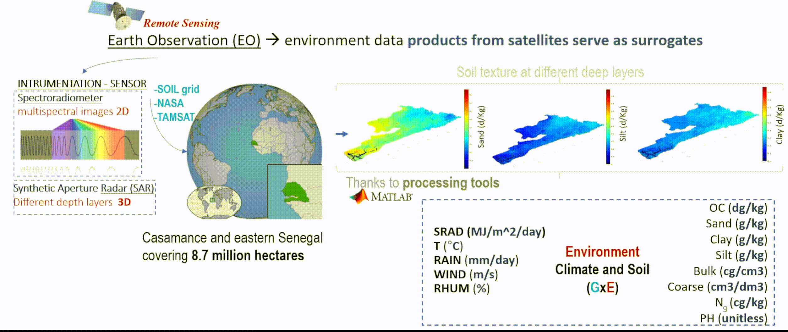

# **Extensive data of the environment**

Crop modeling requires meteorological data inputs to characterize crop responses to environmental conditions. The MCM depends on key variables such as minimum and maximum temperature (°C), solar radiation (MJ/m²/day), wind speed (m/s), relative humidity (\%), and precipitation (mm/day). To apply the model at a regional scale, all these variables are obtained from the NASA POWER dataset (Hodges et al., 2017).

Soil DB is sourced from SoilGrids, with a spatial resolution of 250 meters. This dataset covers the entire study region and provides soil property data at three depth intervals: 15 cm, 30 cm, and 100 cm, which are used as inputs for the crop growth model (Hengl, T. et al., 2017). The measured properties include soil texture, key nutrients, and other relevant factors. 

  

Hodges, R., & others. (2017). NASA POWER (Prediction of Worldwide Energy Resources) data. NASA Langley Research Center. Available at https://power.larc.nasa.gov/

Hengl, T., Mendes de Jesus, J., Heuvelink, G. B. M., Ruiperez Gonzalez, M., Kilibarda, M., Blagotić, A., Shangguan, W., Wright, M. N., Geng, X., Bauer-Marschallinger, B., Guevara, M. A., Vargas, R., MacMillan, R. A., Batjes, N. H., Leenaars, J. G. B., Ribeiro, E., & Wheeler, I. (2017). SoilGrids250m: Global gridded soil information based on machine learning. SoilGrids. https://soilgrids.org. Accessed: 2024-06-24.

- Main Code Meteo --> main_WTH.m
- Main Code Clim --> main_SOIL.m
