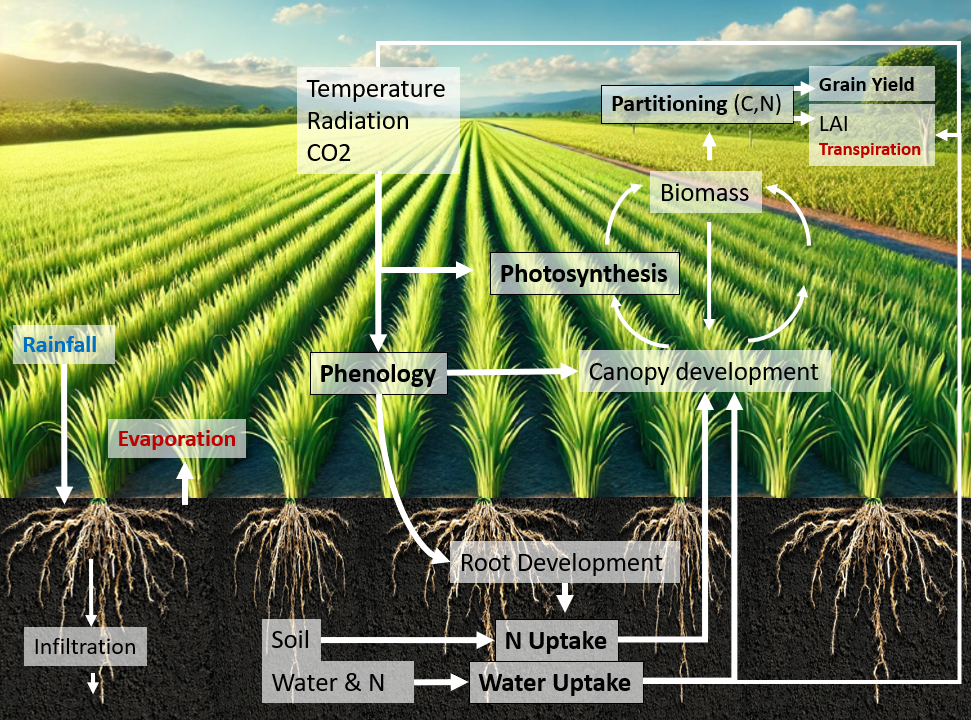
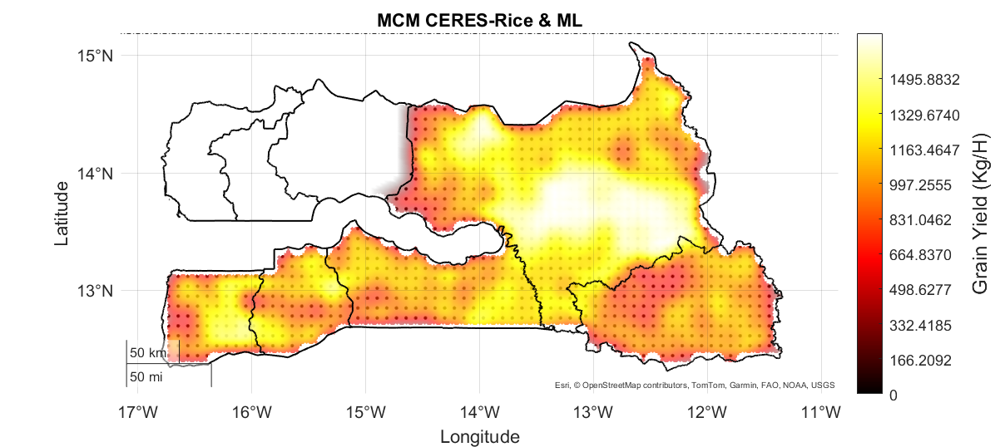

# **Crop-Growth-Modelling**

  

DB --> https://drive.google.com/drive/folders/1FMZphGQxX_SC0YSaqXBsj5B0FJr4Vhov?hl=fr

**Mechanistic crop models (MCMs)** are multidisciplinary tools that integrate expertise in dynamic systems modeling, computational techniques, and plant biology. They capture both the internal mechanisms driving plant growth and the external interactions of these mechanisms within dynamic cropping systems [1][2].
The goal of MCM is to simulate plant growth as the product of a series of interactions among the plant and environment. The model functions as an integrated system of reduced algorithms, each describing a different interaction and cohesively linking all model components [1]. Notable and widely-used crop growth models include DSSAT (USA), APSIM (Australia), STICS (France), and AquaCrop (Italy) [3]. 

[1] https://doi.org/10.1007/s13593-022-00854-9
[2] https://doi.org/10.1093/jxb/erp375
[3] https://doi.org/10.1093/jxb/erz175

  

# Project: Rice Crop Ideotype Optimization with CERES-Rice Model
**Software**: MathWorks (2024). MATLAB (Version 2024b)

---

## Code Structure

### 1. Environment Characterization
- **Main Code**: `MAIN_CLUSTER.m`
- **Functions**:
  - `SOILcluster.m`
  - `CLIMcluster.m`
  - `graphicENVIRONMENTS.m`
- **Output**:
  - `Results/CLIM_CLUSTER_GMM`
  - `Results/SOIL_CLUSTER_GMM`
  - `Results/SOIL(1-2-3)`

---

### 1_. Environment Representation - Convex Hull
- **Main Code**: `MAIN1_Environment_representation.m`
- **Functions**:
  - `convhullMAP.m`
  - `POPULATION_READ.m`
  - `graphicENVIRONMENTS.m`
- **Output**:
  - `Results/Environment`

---

### 2. Sensitivity Analysis
- **Main Code**: `MAIN_sensitivity.m`
- **Functions**:
  - `sensitivity.m`
  - `MECHANISTIC.m`
  - `SENgraph2.m`
  - `generateRSITable.m`
- **Output**:
  - `RelativeSensitivityIndex.xlsx`

---

### 3. Genetic Algorithm Optimization - Ideotype Design
- **Main Code**: `MAIN_2.m`
- **Functions**:
  - `Pop_ini.m`
  - `eval_fitness_csm.m`
  - `CERES_Rice.m`
  - `Select_parents.m`
  - `Crossover_parents.m`
  - `Mutation.m`
  - `Visual_Ind.m`
- **Output**:
  - `Ideotype.xlsx`

---

### 4. Ideotype Similarity Analysis
- **Main Code**: `MAIN_2_INTEGRATE.m`
- **Functions**:
  - `POPULATION_READ.m`
  - `Visual_Ind2.m`
- **Output**:
  - `Results/Genotypic_similarity_with_progeny`

---

### 4_. Ideotype Visualization - "HI-WUE" Analysis
- **Main Code**: `MAIN_2RESULTS.m`
- **Output**:
  - `Results/Regressor`

---

### GA Optimization for Model Calibration
- **Main Code**: `MAIN_GA.m`
- **Functions**:
  - `Pop_ini.m`
  - `eval_fitness_csm.m`
  - `CERES_Rice.m`
  - `Select_parents.m`
  - `Crossover_parents.m`
  - `Mutation.m`
  - `Visual_Ind.m`
- **Output**:
  - `AG3.mat (AG3.ind_best)`
  - `Results/`

---

## Notes
- All outputs are organized inside the `Results/` folder.
- Ensure that required toolboxes for clustering, optimization, and statistics are available in MATLAB 2024b.
- For any environment-specific data inputs (climate or soil), please follow the provided input data format guidelines.

---
